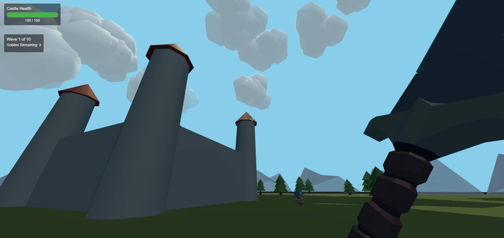

# Defend The Castle

A third-person action defense game built with Three.js where players control a character defending their castle against waves of enemies. This project was mostly a fun side project I wanted to work on to toy around with newer technologies.

## Features

- Third-person character control
- Wave-based enemy spawning system
- Castle defense mechanics
- Tower placement and management
- Hero abilities and combat system
- Dynamic difficulty scaling

## Tech Stack

- Three.js for 3D rendering
- Cannon.js for physics
- React for UI components
- Webpack for bundling
- ESLint/Prettier for code quality

## Project Structure

```
src/
  ├── assets/               # Game models, textures, and animations
  ├── components/           # Reusable game entities
  ├── game/                 # Core game logic
  ├── hero/                 # Player character code
  ├── ui/                   # UI components
  ├── utils/                # Utility functions
  ├── scenes/               # Three.js scenes
  ├── systems/              # Game systems
  └── main.js               # Entry point
```

## Setup
 - npm ci
 - npm run start
 - npm run teardown

## License

This project is licensed under the MIT License - see the LICENSE file for details. 

